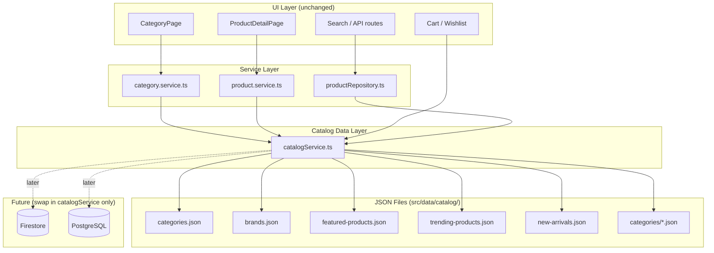

# Catalog Architecture

**Date:** 2026-06-12  
**Pattern:** Repository abstraction via `catalogService` — JSON today, database tomorrow

---

## Architecture Diagram



---

## Data Flow

### Category Page

```
/category/guitars
  → CategoryPage (client)
  → useCategoryProducts hook
  → fetchCategoryProducts("guitars", filters)
  → catalogService.getProductsByCategory("guitars")
  → categories/guitars.json
  → toProduct() adapter
  → Product[] (existing UI type)
```

### Product Detail Page

```
/product/fender-player-stratocaster-polar-white
  → ProductDetailPage (client)
  → fetchProductDetail(slug)
  → catalogService.getProductDetailBySlug(slug)
  → categories/guitars.json (lookup by slug)
  → toProductDetail() adapter
  → ProductDetail (existing UI type)
```

### Search API

```
GET /api/products?category=guitars&q=fender
  → productRepository.searchProducts()
  → catalogService.searchProducts()
  → all category JSON files (merged + cached)
```

---

## Type System

```
src/types/
├── catalog.ts      → CatalogProduct, CatalogProductDetail (JSON schema)
├── product.ts      → Product, ProductDetail (UI/runtime types)
├── category.ts     → Category
└── brand.ts        → Brand
```

**Adapters in `catalogService.ts`:**

| Function | Input | Output |
|----------|-------|--------|
| `toProduct()` | `CatalogProduct` | `Product` |
| `toProductDetail()` | `CatalogProduct` | `ProductDetail` |

Components never import JSON directly — they consume `Product` / `ProductDetail` types through services.

---

## catalogService API

| Function | Source |
|----------|--------|
| `getAllProducts()` | All category JSON files (cached) |
| `getProductBySlug(slug)` | Slug index (cached) |
| `getProductDetailBySlug(slug)` | Slug index + detail block |
| `getProductsByCategory(slug)` | `categories/{file}.json` |
| `getFeaturedProducts()` | `featured-products.json` |
| `getTrendingProducts()` | `trending-products.json` |
| `getNewArrivals()` | `new-arrivals.json` |
| `getRelatedProducts(slug)` | Product detail.relatedProductIds |
| `searchProducts(options)` | Merged catalog + filters |
| `getBrands()` | `brands.json` |
| `getCategories()` | `categories.json` |
| `getCategoryBySlug(slug)` | `categories.json` lookup |
| `getProductSummaries(ids)` | ID index |
| `getAllProductSlugs()` | All slugs for SSG |

---

## Database Migration Path

When moving to Firestore or PostgreSQL:

1. **Only modify `catalogService.ts`** — replace JSON imports with async DB queries
2. Keep all function signatures and return types (`Product`, `ProductDetail`, `Category`, `Brand`)
3. UI components, hooks, and page routes require **zero changes**
4. Admin panel can continue using Firestore `products` / `categories` collections independently
5. Optionally sync admin writes → storefront DB via webhooks or shared repository

```typescript
// Future example — catalogService.ts only
export async function getAllProducts(): Promise<Product[]> {
  const rows = await db.query("SELECT * FROM products");
  return rows.map(toProduct);
}
```

---

## Compatibility Shims

Legacy import paths preserved for gradual migration:

| Legacy Path | Delegates To |
|-------------|--------------|
| `src/data/products.ts` → `PRODUCTS` | `catalogService.getAllProducts()` |
| `src/data/productDetails.ts` | `catalogService` exports |
| `src/data/categories.ts` → `CATEGORIES` | `catalogService.getCategories()` |

---

## Summary

| Metric | Value |
|--------|-------|
| Total Products | 39 |
| Total Categories | 14 |
| Total Brands | 29 |
| JSON Files Created | 19 |
| Service Files Created | 1 (`catalogService.ts`) |
| Type Files Created/Updated | 3 |
| Files Refactored | 7 |
