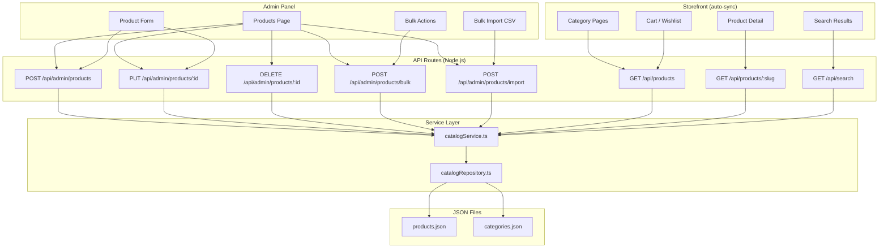

# Catalog Sync Report — Single JSON Source of Truth

**Date:** 2026-06-12  
**Storage:** `src/data/catalog/products.json` (local JSON only — no Firestore/PostgreSQL)

---

## 1. Product Architecture Diagram



---

## 2. JSON Schema Used

### `products.json` — single source of truth (one record per product)

```json
{
  "id": "prod-abc123",
  "slug": "fender-player-stratocaster",
  "name": "Player Stratocaster",
  "brand": "Fender",
  "category": "Guitars",
  "subcategory": "",
  "price": 70830,
  "originalPrice": 81454,
  "discountPercentage": 13,
  "rating": 4.8,
  "reviewCount": 412,
  "stock": 100,
  "sku": "VM-00001",
  "status": "active",
  "featured": false,
  "trending": false,
  "newArrival": false,
  "images": ["/images/..."],
  "description": "...",
  "specifications": { "Manufacturer": "Fender" },
  "createdAt": "2026-06-12T00:00:00.000Z",
  "updatedAt": "2026-06-12T00:00:00.000Z",
  "brandSlug": "fender",
  "categorySlug": "guitars",
  "availability": "in-stock",
  "condition": "new",
  "imageColor": "#e8e8e8",
  "image": "/images/...",
  "detail": { "...": "PDP enrichment (variants, reviews, related IDs)" }
}
```

### `categories.json` — metadata only (no embedded products)

```json
{
  "id": "cat-1",
  "name": "Guitars",
  "slug": "guitars",
  "description": "Shop guitars from top brands..."
}
```

**Product count** is computed at runtime:  
`getProductsByCategory("guitars")` filters `products.json` by `categorySlug`.

---

## 3. Files Created

| File | Purpose |
|------|---------|
| `src/data/catalog/products.json` | Master product catalog (39 products migrated) |
| `src/lib/server/catalogRepository.ts` | FS read/write with mtime cache |
| `src/app/api/products/[slug]/route.ts` | Product detail API |
| `src/app/api/catalog/categories/route.ts` | Category metadata API |
| `src/app/api/admin/products/bulk/route.ts` | Bulk delete/archive/activate/stock/category |
| `src/app/api/admin/products/import/route.ts` | CSV preview + confirm import |
| `src/components/admin/BulkImportModal.tsx` | Import UI with preview + error export |
| `src/lib/csv.ts` | CSV parse/serialize utilities |
| `src/services/categories.api.ts` | Client-safe category fetch |
| `public/product-import-template.csv` | Downloadable import template |
| `scripts/consolidate-catalog.mts` | One-time merge from category JSON files |

---

## 4. Files Modified

| File | Change |
|------|--------|
| `src/services/catalogService.ts` | Full CRUD + search + bulk import on `products.json` |
| `src/lib/server/adminProductService.ts` | Switched from Firestore → JSON catalogService |
| `src/lib/server/productRepository.ts` | Storefront reads from JSON |
| `src/lib/server/inventoryService.ts` | Stock from JSON |
| `src/lib/server/orderValidation.ts` | Price validation from JSON |
| `src/lib/server/dashboardService.ts` | Product KPIs from JSON |
| `src/services/category.service.ts` | Fetches live data via `/api/products` |
| `src/services/product.service.ts` | Fetches live PDP via `/api/products/:slug` |
| `src/app/admin/products/page.tsx` | Bulk import + bulk actions |
| `src/components/admin/ProductFormPage.tsx` | Category dropdown + featured flags |
| `src/data/categories.ts` | Static metadata from `categories.json` only |
| `src/types/catalog.ts` | Updated schema with `status`, `featured`, timestamps |
| `src/app/product/[slug]/page.tsx` | Dynamic product routes (`dynamicParams`) |
| `src/components/cart/CartPage.tsx` | Live catalog via API |
| `src/store/wishlistStore.ts` | No static product dependency |

---

## 5. Bulk Import Workflow

1. Admin → Products → **Import CSV**
2. Download template from `/product-import-template.csv`
3. Upload CSV → **Preview** (validation per row)
4. System validates: required fields, category exists, price format, duplicate SKU/slug
5. Preview table shows valid/invalid rows with error messages
6. Admin clicks **Confirm Import**
7. Valid rows appended to `products.json` via `bulkImportProducts()`
8. Result report: Imported / Skipped / Errors
9. Failed rows exportable as CSV

---

## 6. Automatic Category Synchronization Workflow

```
Admin creates product with categorySlug = "guitars"
        ↓
createProduct() writes to products.json
        ↓
getProductsByCategory("guitars") filters products.json
        ↓
Category page (/category/guitars) fetches /api/products?category=guitars
        ↓
Product appears immediately — no category file edits
```

Related products are rebuilt dynamically from same category/brand on each save.

---

## 7. Search Synchronization Workflow

```
Admin adds/edits/deletes product in products.json
        ↓
GET /api/search?q=fender reads catalogService.searchProducts()
        ↓
Active products only (status === "active")
        ↓
Search results + suggest mode update immediately
```

---

## 8. Validation Results

| Check | Result |
|-------|--------|
| `npm run type-check` | ✅ Pass |
| `npm run build` | ✅ Pass |
| `npx tsx scripts/validate-catalog.mts` | ✅ 39 products, 0 duplicate slugs/SKUs |
| `npm run lint` | ⚠️ Pre-existing checkout warnings (unchanged) |

---

## How Admin CRUD Works

| Action | Behavior |
|--------|----------|
| **Create** | Validates → generates ID/slug/SKU → writes `products.json` |
| **Edit** | Updates record in `products.json` → rebuilds related product IDs |
| **Delete** | Hard removes from `products.json` |
| **Bulk Archive/Activate** | Updates `status` field in batch |
| **Bulk Delete** | Removes multiple records |
| **Bulk Stock** | Updates `stock` + `availability` |
| **Bulk Category** | Updates `category` + `categorySlug` |

---

## Future Database Migration

Replace `catalogRepository.ts` read/write implementations only.  
All admin UI, storefront components, and API route signatures remain unchanged.
